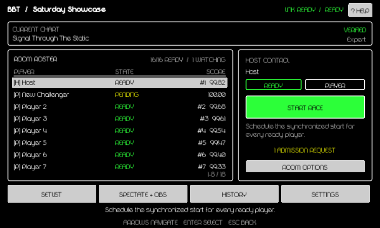

# Beatblock Together

Beatblock Together is a Windows direct-IP competition mod. One player hosts a password-protected room for up to 15 other players and 32 telemetry spectators. The host manages charts, readiness, starts, rankings, spectator streams, OBS exports, and match history from inside Beatblock.

## Player quick start

1. Open the [GitHub Releases page](https://github.com/DupeisTaken/beatblock-online/releases), download `BeatblockTogetherInstaller.exe` from the newest release, and run it.
2. Confirm the **Selected game** card points to the folder you intend to modify. The Install page shows the adapter, OBS source, Windows Firewall profile, and uncertified-build choices together before anything changes. A green **SUPPORTED** badge identifies the certified build.
3. Choose **Install / Update** and follow the concrete phase shown above the progress bar. If progress pauses at the firewall phase, approve the native Windows administrator prompt on the secure desktop once. A result banner and one completion dialog report the final verified outcome; failures include the underlying Windows diagnostic.
4. Choose **Launch Beatblock** in the completion dialog to verify Lovely initialization, or close the installer and launch normally through Steam.
5. Open **Online**, then host a room or join with the host's `IP:port` and password.
6. Follow the dashboard's highlighted next action to select or verify the chart, ready players, and start the race. Select a roster row for participant details; the bottom utility bar opens Setlist, Spectate + OBS, History, and Settings without losing dashboard position.
7. Choose **Exit Online** when finished; the local runtime, API, exports, and renderers close with the Online session.



## Recommended specifications

These are engineering recommendations for Beatblock Together in addition to the requirements of Beatblock and OBS:

| Use                                   | CPU                         | Memory            | GPU                                        | Disk                | Network                                                                                              |
| ------------------------------------- | --------------------------- | ----------------- | ------------------------------------------ | ------------------- | ---------------------------------------------------------------------------------------------------- |
| Player or spectator                   | Modern 4-core/8-thread x64  | 8 GiB system RAM  | A GPU that already runs Beatblock reliably | SSD with 1 GiB free | 5 Mbps down / 1 Mbps up                                                                              |
| Host without reconstructed OBS video  | Modern 6-core/12-thread x64 | 16 GiB system RAM | A GPU that already runs Beatblock reliably | SSD with 1 GiB free | 250 Mbps upload for the maximum 48-participant room; 10 Mbps upload for a typical 8-participant room |
| Broadcast host, four 720p60 renderers | Modern 8-core/16-thread x64 | 32 GiB system RAM | Dedicated GPU with 8 GiB VRAM              | SSD with 2 GiB free | Same room-host upload, plus the streaming service's requirement                                      |

The maximum-room network recommendation is intentionally conservative: the current protocol republishes a roughly 21 KiB modeled room snapshot at up to 20 Hz to each peer. Smaller rooms scale approximately with peer count. Four 720p60 renderers also move at least 843.75 MiB/s of raw RGBA pixels through the capture path before OBS copies and composition. See [the measured and calculated budgets](docs/benchmarking.md#recommended-system-and-network-specifications) and [OBS-specific guidance](docs/obs-setup.md#broadcast-host-performance-budget).

## Developer commands

Install Node workspace dependencies once with `pnpm install`. Rust must be available on `PATH`.

```text
pnpm generate:protocol  Regenerate protocol v2 schemas
pnpm test:mod           Package and fully validate both Lua adapters against .test
pnpm test:mod:source    Run the source-safe adapter gate used by GitHub Actions
pnpm test               Run protocol and Rust unit tests
pnpm test:stress        Run direct-room and export stress tests
pnpm trial              Run the complete acceptance and benchmark suite
pnpm build:protocol     Build the cross-platform protocol package
pnpm build              Reproduce all dependencies and build the Windows release
```

`pnpm build` runs on Windows, downloads checksum-pinned OBS inputs, builds the exact pinned Lovely source with the reviewed patch, and writes ignored outputs under `artifacts/`, `release/`, and `mod/releases/`. Development scripts operate on the repository and disposable `.test` copy. Players install and launch through the GUI and Steam.

## Detailed documentation

- [Installation, repair, adapters, and injection](docs/injection.md)
- [Adaptive Online dashboard and controls](docs/mod-guide.md)
- [Hosting, joining, setlists, and chart verification](docs/operator-guide.md)
- [OBS streams, local API, and text exports](docs/obs-setup.md)
- [Protocol v2](docs/protocol.md)
- [Installer/runtime architecture](docs/architecture.md)
- [Tests, benchmarks, and trial reports](docs/benchmarking.md)
- [Reproducible builds and GitHub releases](docs/releasing.md)

The latest automated gate is [full-capability-latest.md](reports/trial-runs/full-capability-latest.md). The latest arbitrary-folder installer and Lovely recovery is [installer-reliability-latest.md](reports/trial-runs/installer-reliability-latest.md). UI captures are generated from the shipped Lua dashboard with Beatblock's reference fonts and 600x360 logical canvas.

## Components

- `mod`: shared Lua telemetry/gameplay core and mutually exclusive standalone Lovely and BeatblockPlus adapters.
- `companion`: feature-gated Rust installer and hidden runtime sharing installer, networking, SQLite, renderer, API, and export libraries.
- `obs-plugin`: native Stream A-D video source and shared-memory frame integration.
- `protocol`: protocol v2 JSON Schema and TypeScript conformance implementation.
- `reports/trial-runs`: machine-readable and Markdown acceptance evidence.

## Current alpha scope

Windows 10 2004+ and Windows 11 x64 are supported. A room supports 16 players, 32 telemetry spectators, four stable host renderer slots, password admission, optional host approval, synchronized starts, chart verification, authoritative event-derived rankings, SQLite history, and atomic OBS text exports.
