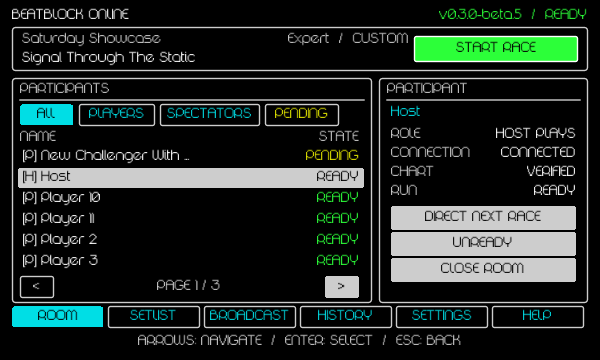

# Beatblock Online

Beatblock Online is a Windows direct-IP competition mod. One player hosts a password-protected room for up to 15 other players and 32 spectators. The host manages charts, readiness, starts, rankings, Broadcast plans, OBS exports, and match history from inside Beatblock.

The current prerelease candidate is [`v0.3.0-beta.2`](docs/releases/v0.3.0-beta.2.md).
It hardens per-attempt scoring and reconnect recovery, adds host-selectable
competitive checks, rejects duplicate usernames, clears retained player state,
sources OBS accuracy and Results from the delayed player stream, supports custom
OBS installation folders, and clears stale per-stream text when assignments end.

## Player quick start

1. Open the [GitHub Releases page](https://github.com/DupeisTaken/beatblock-online/releases), download `BeatblockOnlineInstaller.exe` from the newest release, and run it.
2. Confirm the **Selected game** card points to the folder you intend to modify. The Install page shows the adapter, OBS source, Windows Firewall profile, and uncertified-build choices together before anything changes. A green **SUPPORTED** badge identifies the certified build.
3. Choose **Install / Update** and follow the concrete phase shown above the progress bar. If progress pauses at the firewall phase, approve the native Windows administrator prompt on the secure desktop once. A result banner and one completion dialog report the final verified outcome; failures include the underlying Windows diagnostic.
4. Choose **Launch Beatblock** in the completion dialog to verify Lovely initialization, or close the installer and launch normally through Steam.
5. Open **Online**, then host a room or follow the [Player joining guide](docs/operator-guide.md#join-a-room-as-a-player) with the host's public address, UDP port, and password. When the host uses frp, Players enter the frp server's public address and UDP `remotePort`.
6. Follow the session strip's highlighted next action. Select a roster row for its persistent participant inspector; the host can Play or Direct, choose competitive or casual Run Checks, Setlist supports ordered commands and next-chart continuation, and Broadcast exposes per-stream advanced export settings. A Spectator only receives Broadcast when the host grants Commentator access.
7. Choose **Exit Online** when finished; the local runtime, API, exports, and renderers close with the Online session.

If joining or scoring does not behave as expected, start with the
[player troubleshooting table](docs/operator-guide.md#player-connection-and-result-troubleshooting).
It maps the messages shown by the current runtime—including **username taken**,
**INVALID**, **DNF**, reconnecting, and chart mismatch—to player actions.



## Submit an issue

Before submitting, complete these checks:

1. Install and test the newest Beatblock Online release, or note why the newest
   release cannot be tested.
2. Search both [open issues](https://github.com/DupeisTaken/beatblock-online/issues)
   and [closed issues](https://github.com/DupeisTaken/beatblock-online/issues?q=is%3Aissue%20is%3Aclosed)
   for the same problem or request.
3. Follow the
   [player troubleshooting table](docs/operator-guide.md#player-connection-and-result-troubleshooting)
   or the relevant detailed guide before reporting a defect.
4. Isolate one problem or request per issue. For bugs, reproduce it where
   possible and collect the exact versions, minimal steps, visible error, and a
   short relevant log excerpt or screenshot.
5. Remove room passwords, public addresses, usernames, filesystem user names,
   tokens, and other private data from every attachment and example.

Choose the guided template that matches the issue:

- [Report a bug](https://github.com/DupeisTaken/beatblock-online/issues/new?template=bug_report.yml)
- [Request a new feature](https://github.com/DupeisTaken/beatblock-online/issues/new?template=feature_request.yml)
- [Improve existing behavior](https://github.com/DupeisTaken/beatblock-online/issues/new?template=enhancement_request.yml)
- [Request a documentation change](https://github.com/DupeisTaken/beatblock-online/issues/new?template=documentation.yml)
- [Ask a question](https://github.com/DupeisTaken/beatblock-online/issues/new?template=question.yml)

Read the [issue tags and reporting guide](docs/issues.md) for help choosing a
type and for title, evidence, environment, and triage guidelines.

## Recommended specifications

These are engineering recommendations for Beatblock Online in addition to the requirements of Beatblock and OBS:

| Use                                   | CPU                         | Memory            | GPU                                        | Disk                | Network                                                                                              |
| ------------------------------------- | --------------------------- | ----------------- | ------------------------------------------ | ------------------- | ---------------------------------------------------------------------------------------------------- |
| Player or spectator                   | Modern 4-core/8-thread x64  | 8 GiB system RAM  | A GPU that already runs Beatblock reliably | SSD with 1 GiB free | 5 Mbps down / 1 Mbps up                                                                              |
| Host without reconstructed OBS video  | Modern 6-core/12-thread x64 | 16 GiB system RAM | A GPU that already runs Beatblock reliably | SSD with 1 GiB free | 250 Mbps upload for the maximum 48-participant room; 10 Mbps upload for a typical 8-participant room |
| Broadcast host, four 720p60 renderers | Modern 8-core/16-thread x64 | 32 GiB system RAM | Dedicated GPU with 8 GiB VRAM              | SSD with 2 GiB free | Same room-host upload, plus the streaming service's requirement                                      |

The maximum-room network recommendation is intentionally conservative: the current protocol republishes a roughly 21 KiB modeled room snapshot at up to 20 Hz to each peer. Smaller rooms scale approximately with peer count. Four 720p60 renderers also move at least 843.75 MiB/s of raw RGBA pixels through the capture path before OBS copies and composition. See [the measured and calculated budgets](docs/benchmarking.md#recommended-system-and-network-specifications) and [OBS-specific guidance](docs/obs-setup.md#broadcast-host-performance-budget).

## Developer commands

Install Node workspace dependencies once with `pnpm install`. Rust must be available on `PATH`.

```text
pnpm generate:protocol  Regenerate protocol v3 schemas
pnpm test:ui           Render and compare all 600x360 UI scenarios
pnpm test:mod           Package and fully validate both Lua adapters against .test
pnpm test:mod:source    Run the source-safe adapter gate used by GitHub Actions
pnpm test               Run protocol and Rust unit tests
pnpm test:stress        Run direct-room and export stress tests
pnpm trial              Run the complete acceptance and benchmark suite
pnpm build:protocol     Build the cross-platform protocol package
pnpm build              Reproduce all dependencies and build the Windows release
```

`pnpm build` runs on Windows, downloads checksum-pinned OBS inputs, builds the exact pinned Lovely source with the reviewed patch, and writes ignored outputs under `artifacts/`, `release/`, and `mod/releases/`. The only local installer review copy is `release/BeatblockOnlineInstaller.exe`. Development scripts operate on the repository and disposable `.test` copy. Players install and launch through the GUI and Steam.

Test runs may create owned directories named `bbt-*` under `%TEMP%`. Successful UI
runs remove their `bbt-ui-*` stage automatically, but a terminated process can
leave a stage behind. Before deleting leftovers, stop only BBT processes started
by the test, verify every target is inside `%TEMP%`, and preserve the
`E:\beatblock-online\.test\ui-harness` fixture. See
[temporary artifact hygiene](docs/benchmarking.md#temporary-artifact-hygiene).

## Detailed documentation

- [Ship-readiness security, correctness, resource, and UX audit](reports/ship-readiness-audit-2026-07-20.md)
- [Installation, repair, adapters, and injection](docs/injection.md)
- [Adaptive Online dashboard and controls](docs/mod-guide.md)
- [Hosting, joining, setlists, and chart verification](docs/operator-guide.md)
- [OBS streams, local API, and text exports](docs/obs-setup.md)
- [Protocol v3](docs/protocol.md)
- [Installer/runtime architecture](docs/architecture.md)
- [Tests, benchmarks, and trial reports](docs/benchmarking.md)
- [Reproducible builds and GitHub releases](docs/releasing.md)
- [Issue tags and reporting guidelines](docs/issues.md)
- [v0.3.0-beta.2 release notes](docs/releases/v0.3.0-beta.2.md)

The latest automated gate is [full-capability-latest.md](reports/trial-runs/full-capability-latest.md). The latest arbitrary-folder installer and Lovely recovery is [installer-reliability-latest.md](reports/trial-runs/installer-reliability-latest.md). UI captures are generated from the shipped Lua dashboard with Beatblock's reference fonts and 600x360 logical canvas.

## Components

- `mod`: shared Lua telemetry/gameplay core and mutually exclusive standalone Lovely and BeatblockPlus adapters.
- `companion`: feature-gated Rust installer and hidden runtime sharing installer, networking, SQLite, renderer, API, and export libraries.
- `obs-plugin`: native Stream A-D video source and shared-memory frame integration.
- `protocol`: protocol v3 JSON Schema and TypeScript conformance implementation; archived v2 remains for compatibility diagnostics.
- `reports/trial-runs`: machine-readable and Markdown acceptance evidence.

## Current beta scope

Windows 10 2004+ and Windows 11 x64 are supported. A room supports 16 players, 32 telemetry spectators, four stable host renderer slots, password admission, optional host approval, synchronized starts, chart verification, authoritative event-derived rankings, SQLite history, and atomic OBS text exports.
