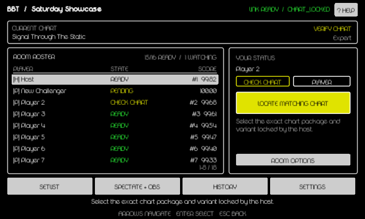
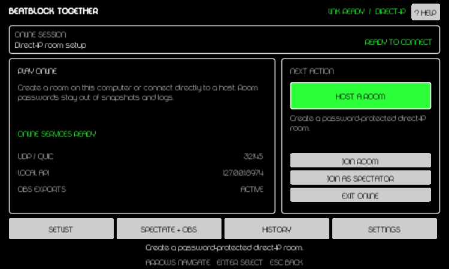
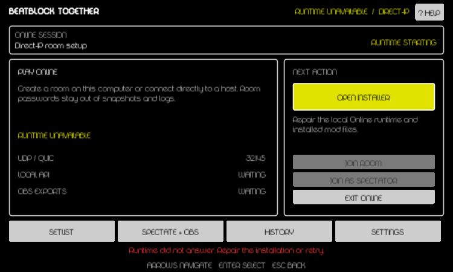
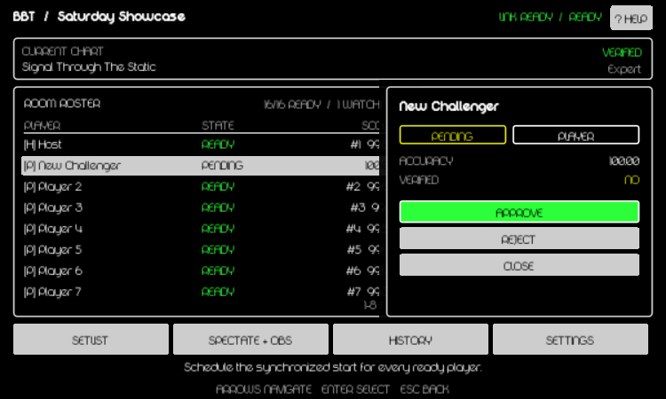
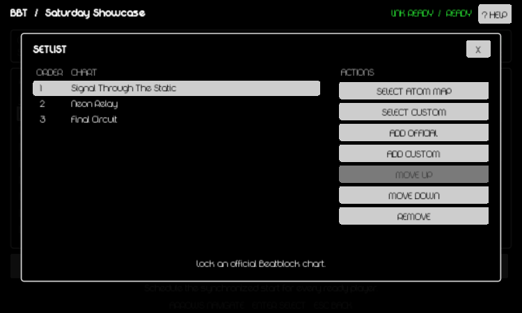
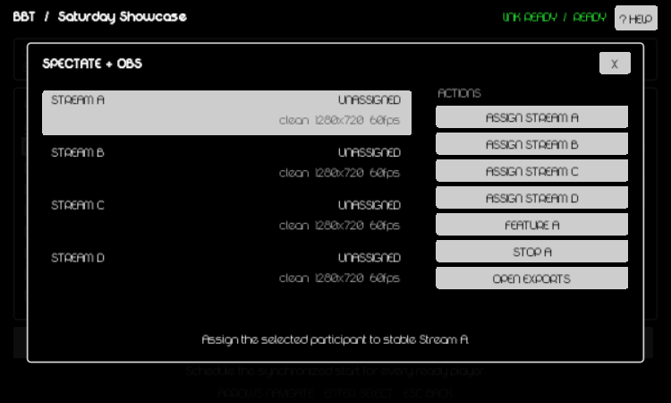
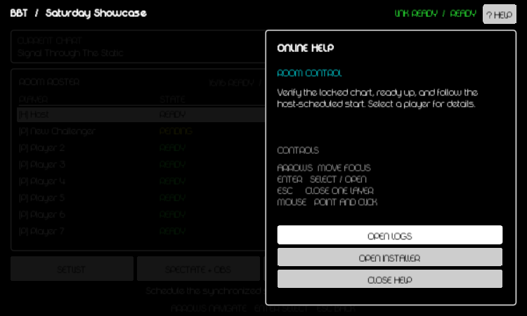

# Adaptive Online dashboard

Opening **Online** lazily starts the hidden runtime, localhost API, and atomic exports. There are no equal-weight page tabs: one dashboard changes between Connect, Lobby, and Results while keeping the room, chart, verification, readiness, roster, connection, and next action visible together.

## What stays on screen

| Area                | Purpose                                                                                                                                            |
| ------------------- | -------------------------------------------------------------------------------------------------------------------------------------------------- |
| Header              | Room name, runtime link state, room lifecycle, and contextual Help.                                                                                |
| Chart strip         | Locked song, variant, and this client's verification result.                                                                                       |
| Roster              | Eight visible rows with host/player/spectator marker, connection or ready state, rank, and accuracy. The footer shows the visible range and total. |
| Status/control card | Local role and status, one highlighted next action, a short current-state description, and admission/result alerts.                                |
| Utility bar         | Focused Setlist, Spectate + OBS, History, and Settings overlays.                                                                                   |
| Footer              | Description of the focused control and the shared keyboard/controller bindings.                                                                    |

Roster markers are `[H]` host, `[P]` player, and `[S]` spectator. Important states always use text or a symbol as well as color: green is ready/success, yellow needs attention, cyan is informational/navigation, and red is destructive or invalid.

## State-driven next action

The large button is derived from the protocol-v2 room snapshot and local role. An explicit participant verification result takes priority over any older local status, so a mismatch cannot appear ready.

| State                                          | Highlighted action                                                        |
| ---------------------------------------------- | ------------------------------------------------------------------------- |
| Runtime unavailable                            | **Open Installer**                                                        |
| Not in a room                                  | **Host a Room**; Join Room and Join as Spectator remain directly below it |
| Host, no locked chart                          | **Select Chart**                                                          |
| Player package or variant mismatch             | **Locate Matching Chart**                                                 |
| Verified player                                | **Ready**                                                                 |
| Ready non-host                                 | **You Are Ready** (waiting for host)                                      |
| Host, every assigned player ready and verified | **Start Race**                                                            |
| Countdown or gameplay                          | **Race in Progress**; administrative actions are locked                   |
| Results with another setlist chart             | **Advance Setlist**                                                       |
| Completed set                                  | **View Results**                                                          |

## Connecting

The Connect state shows Online service status, configured UDP port, localhost API, and export state in one panel.

- **Host a Room** asks for room name, UDP port, password, display name, and optional host approval.
- **Join Room** asks for the host `IP:port`, password, and display name.
- **Join as Spectator** uses the same form but requests the spectator role.
- **Exit Online** asks for confirmation before terminating session services.

Passwords travel only through the local runtime control channel and the room's password-authenticated handshake. They are never included in room snapshots, join links, exports, or logs.

If the runtime cannot start, the primary action becomes **Open Installer** and the footer shows the concrete repair error.

## Roster and contextual controls

Move focus left from the primary action to enter the roster. Up/down scrolls through all admitted participants and pending requests while preserving an eight-row viewport. Selecting a row opens a compact participant card without leaving the dashboard.

Everyone can inspect role, connection, verification, rank, accuracy, and validity. The host additionally receives context-appropriate controls:

- approve or reject a pending admission;
- switch an admitted participant between player and spectator while the room is unlocked;
- remove an admitted participant while the room is unlocked.

Reject, remove, close-room, force-start, history deletion, token rotation, and runtime restart use confirmation dialogs. Back closes only the topmost card, dialog, drawer, or overlay.

**Room Options** holds controls that should not compete with the next action: copy the password-free `bbt://` link, Force Start, Unready, Leave Room, Close Room, and Exit Online according to role and lifecycle.

## Focused utilities

The utility overlays temporarily cover the dashboard. Closing one restores the same roster selection, scroll offset, and room state.

- **Setlist:** lock an Atom Map or custom chart, append official/custom charts, reorder or remove entries, and locate the host's exact chart as a participant.
- **Spectate + OBS:** assign the selected roster participant to stable Stream A-D, choose the featured slot, stop a renderer, and open text exports.
- **History:** refresh saved summaries, delete a selected result, or prune raw journals older than 30 days while retaining summaries.
- **Settings:** toggle the gameplay HUD; inspect protocol, runtime, connection, peers, renderer budget, and local API; open logs/exports; rotate the API token; restart the runtime; or open the installer.

## Help and navigation

**Help** opens a right-side drawer whose explanation follows the current phase or open utility. It also provides Open Logs and Open Installer troubleshooting shortcuts and remains available offline.

Mouse, keyboard, and controller use one focus order: roster, primary action, contextual action, utility bar, and Help. Arrow inputs move focus, **Select/Enter** activates it, and **Back/Escape** closes one layer. Mouse hover and controller focus use the same highlighted state and Beatblock menu sounds.

The minimal gameplay HUD remains enabled by default and shows rank, accuracy delta, link state, and warnings. Disable it from Settings; this does not stop telemetry or OBS exports.

## Session shutdown

**Exit Online** closes or leaves the room, stops renderer children, flushes SQLite and exports, shuts down the localhost API, and terminates the hidden runtime. Online Song Select, gameplay, and Results keep the same session alive. If the runtime crashes during a competitive run, the run is invalidated and only one bounded restart is attempted.
